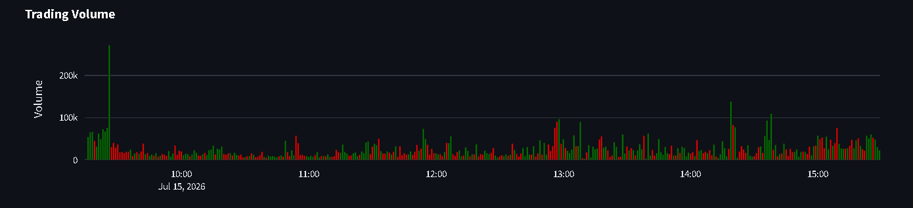
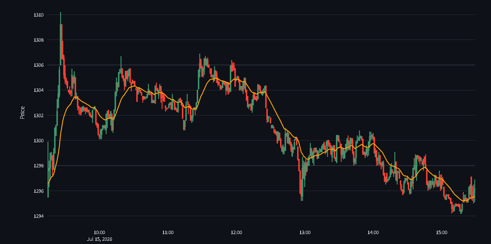
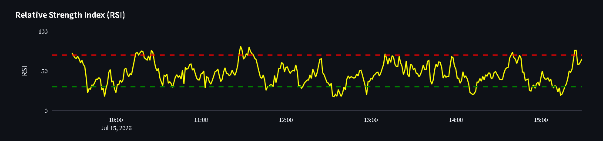
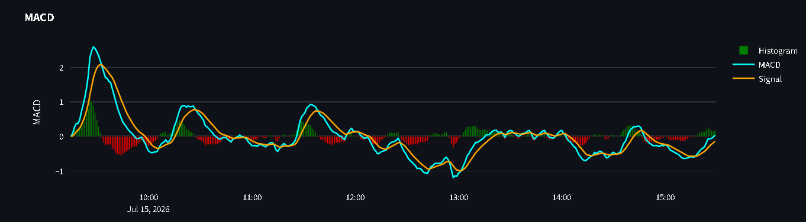
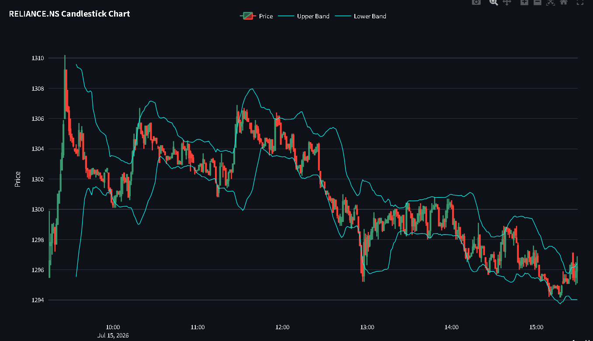
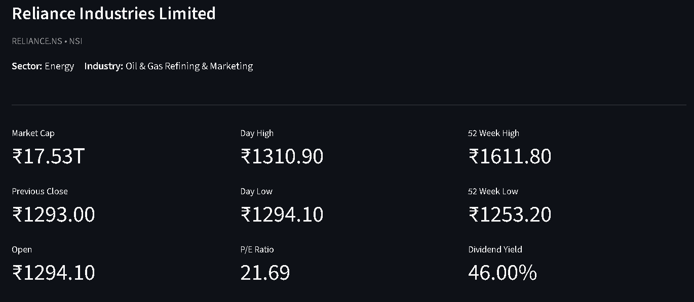

# MarketPulse

MarketPulse is a near-real-time stock market analytics dashboard for exploring NSE-listed companies, built with **FastAPI**, **Streamlit**, and **Plotly**.

Users can search NSE-listed securities, view historical and intraday price data, analyze interactive candlestick charts, apply common technical indicators, inspect company information, and export market data.

The project was built as a practical introduction to financial market data pipelines and dashboard development. It uses a modular frontend-backend architecture in which a FastAPI service handles market-data requests and a Streamlit application provides the interactive interface.

---

## Live Demo

**Application:**  
https://marketpulse-ns3.streamlit.app/

> Market data is sourced primarily from Yahoo Finance and may be delayed or temporarily unavailable depending on the exchange, instrument, or upstream data availability.

---

## Features

### Stock Search

- Search across 2,300+ NSE-listed securities
- Search by company name or ticker symbol
- Ranked search results for improved relevance
- NSE security universe generated using NSELib

### Interactive Charts

- Interactive Plotly candlestick charts
- Trading volume visualization
- Multiple historical timeframes
- Multiple candle intervals
- Optional automatic data refresh

The available historical periods and candle intervals depend on the limitations of the underlying market-data provider.

### Technical Indicators

MarketPulse currently supports:

- Exponential Moving Average (EMA)
- Relative Strength Index (RSI)
- MACD
- Bollinger Bands

Indicators are calculated from the retrieved historical OHLC price data.

### Company Dashboard

Where available, MarketPulse displays:

- Company Name
- Exchange
- Sector
- Industry
- Market Capitalization
- Previous Close
- Open Price
- Day High / Day Low
- 52 Week High / Low
- Dividend Yield
- P/E Ratio

Company metadata availability depends on Yahoo Finance.

### Watchlist

- Add stocks to a watchlist
- Quickly switch between saved stocks
- Remove stocks from the watchlist

### Utilities

- Market Open / Closed Indicator
- CSV Export
- Auto Refresh

---

# Architecture

```text
MarketPulse/
│
├── backend/
│   ├── data/
│   ├── routes/
│   ├── scripts/
│   ├── services/
│   ├── app.py
│   └── requirements.txt
│
├── frontend/
│   ├── components/
│   ├── data/
│   ├── services/
│   ├── utils/
│   ├── app.py
│   └── requirements.txt
│
└── README.md
```

The application follows a simple client-server architecture:

```text
NSELib
   │
   └── NSE Security Universe
              │
              ▼
Streamlit Frontend
       │
       │ HTTP Requests
       ▼
FastAPI Backend
       │
       ▼
Yahoo Finance
       │
       ▼
Market Data + Company Information
```

The NSE security universe is generated using NSELib and stored by the application for stock search. Price history and company information are retrieved through the FastAPI backend using Yahoo Finance.

---

# Deployment

| Component | Deployment |
|------------|------------|
| Frontend | Streamlit Community Cloud |
| Backend | Render |
| Backend Framework | FastAPI |
| Market Data | Yahoo Finance |
| NSE Security Universe | NSELib |

---

# Tech Stack

## Backend

- FastAPI
- Uvicorn
- Pandas
- yFinance
- NSELib

## Frontend

- Streamlit
- Plotly
- Pandas
- Requests

## Data Sources

### Yahoo Finance

Used for:

- Historical OHLC data
- Intraday market data
- Trading volume
- Company information

### NSELib

Used to generate the searchable universe of NSE-listed securities.

The generated security database represents a snapshot of the NSE securities available when the dataset was created and does not automatically synchronize with NSE listings.

---

# Installation

Clone the repository:

```bash
git clone https://github.com/AdvythVaman05/Finance-Projects.git

cd Finance-Projects/MarketPulse
```

Create a virtual environment.

### Windows

```bash
python -m venv .venv
```

### Linux / macOS

```bash
python3 -m venv .venv
```

Activate the virtual environment.

### Windows

```bash
.venv\Scripts\activate
```

### Linux / macOS

```bash
source .venv/bin/activate
```

---

# Running the Backend

Navigate to the backend directory:

```bash
cd backend
```

Install backend dependencies:

```bash
pip install -r requirements.txt
```

Run FastAPI:

```bash
uvicorn app:app --reload
```

Backend URL:

```text
http://127.0.0.1:8000
```

Swagger API Documentation:

```text
http://127.0.0.1:8000/docs
```

---

# Running the Frontend

Open another terminal and navigate to the frontend directory:

```bash
cd frontend
```

Install frontend dependencies:

```bash
pip install -r requirements.txt
```

Run Streamlit:

```bash
streamlit run app.py
```

The frontend will launch automatically in your browser.

For local development, the frontend connects to the FastAPI backend running at:

```text
http://127.0.0.1:8000
```

---

# API Endpoints

## Search Stocks

```text
GET /search
```

### Parameters

```text
q
```

Example:

```text
/search?q=reliance
```

---

## Historical Stock Data

```text
GET /stock
```

### Parameters

```text
ticker
period
interval
```

Example:

```text
/stock?ticker=RELIANCE.NS&period=1%20Month&interval=30m
```

---

## Company Information

```text
GET /company
```

### Parameters

```text
ticker
```

Example:

```text
/company?ticker=RELIANCE.NS
```

---

# Screenshots

## Dashboard

> ### Chart


> ### Trading Volume


---

## Technical Indicators

> ### EMA


> ### RSI


> ### MACD


> ### Bollinger Bands


---

## Company Information

> 

---

# Data Limitations

MarketPulse is an educational market-data application and should not be treated as a professional trading terminal.

Important limitations include:

- Market data may be delayed.
- Intraday data availability depends on Yahoo Finance.
- Very short candle intervals have limited historical availability.
- Company metadata may occasionally be unavailable due to upstream data-provider limitations.
- The searchable NSE security database represents the securities available when the symbol dataset was generated.
- The NSE security database does not currently update automatically.
- Automatic refresh does not create higher-frequency market data. For example, refreshing every 10 seconds while using 1-minute candles still produces 1-minute market candles.
- MarketPulse is intended for market exploration and educational purposes, not execution of financial trades.

---

# Future Improvements

MarketPulse is intentionally kept lightweight. Natural extensions include:

- Automatic synchronization of the NSE security universe
- Support for additional stock exchanges
- Improved market-data caching
- More robust handling of upstream API failures
- Portfolio creation and performance tracking
- Portfolio risk and exposure analytics
- Additional technical and statistical indicators
- Price alerts
- Improved watchlist persistence
- Historical performance comparison between securities
- Improved deployment and backend infrastructure

These additions would extend the dashboard without changing its core purpose as a financial market exploration and analytics application.

---

# Project Motivation

MarketPulse was built as a starting point for learning how financial market applications work end to end.

The project covers several fundamental components of financial software development:

- Retrieving financial market data
- Building a searchable security universe
- Designing a REST API for financial data
- Processing OHLCV time-series data
- Calculating technical indicators
- Building interactive financial visualizations
- Connecting a deployed frontend and backend
- Handling external market-data API limitations

Rather than attempting to predict stock prices or provide investment recommendations, MarketPulse focuses on providing a clean interface for exploring and understanding financial market data.

The project also serves as a foundation for learning more advanced quantitative finance concepts, including portfolio analytics, financial risk modeling, and systematic market analysis.

---

# Current Capabilities

- Search across 2,300+ NSE-listed securities
- FastAPI REST backend
- Interactive Streamlit dashboard
- Candlestick chart visualization
- Trading volume visualization
- EMA, RSI, MACD, and Bollinger Bands
- Company information dashboard
- Watchlist
- CSV export
- Market status indicator
- Configurable automatic refresh
- Deployed Streamlit frontend
- Deployed FastAPI backend
- Modular frontend-backend architecture

---

# License

This project is licensed under the MIT License.

---

# Author

**Advyth Vaman Akalankam**

GitHub: https://github.com/AdvythVaman05

Live Demo: https://marketpulse-ns3.streamlit.app/