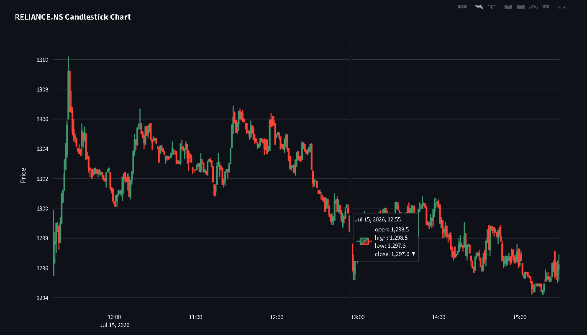

# 📈 MarketPulse

A real-time stock market analytics dashboard built with **FastAPI** and **Streamlit**. MarketPulse enables users to search NSE-listed stocks, visualize interactive candlestick charts, analyze technical indicators, and explore company fundamentals through a clean, responsive web interface.

The project follows a modular frontend-backend architecture and serves as a foundation for more advanced quantitative finance, financial analytics, and AI-powered investment applications.

---

## 🚀 Live Demo

🌐 **Application:** https://marketpulse-ns3.streamlit.app/

---

## ✨ Features

### 🔍 Stock Search
- Search from **2,300+ NSE-listed companies**
- Ranked search results for better relevance
- Fast company lookup
- Company information retrieval

### 📊 Interactive Charts
- Interactive Plotly candlestick charts
- Trading volume visualization
- Multiple historical timeframes
- Multiple candle intervals
- Live chart refresh

### 📈 Technical Indicators
- Exponential Moving Average (EMA)
- Relative Strength Index (RSI)
- MACD
- Bollinger Bands

### 🏢 Company Dashboard
- Company Name
- Exchange
- Sector
- Industry
- Market Capitalization
- Previous Close
- Open Price
- Day High / Day Low
- 52 Week High / Low
- Dividend Yield
- P/E Ratio

### ⭐ Watchlist
- Add favourite stocks
- Remove stocks
- Persistent local watchlist

### ⚙️ Utilities
- Market Open / Closed Indicator
- CSV Export
- Auto Refresh

---

# 🏗️ Architecture

```
MarketPulse
│
├── backend
│   ├── routes
│   ├── services
│   ├── scripts
│   ├── data
│   └── app.py
│
├── frontend
│   ├── components
│   ├── services
│   ├── utils
│   ├── data
│   └── app.py
│
├── requirements.txt
└── README.md
```

---

# 🚀 Deployment

| Component | Technology |
|------------|------------|
| Frontend | Streamlit Community Cloud |
| Backend | FastAPI |
| Data Source | Yahoo Finance + NSELib |

---

# 🛠️ Tech Stack

## Backend

- FastAPI
- Uvicorn
- Pandas
- yFinance
- NSELib

## Frontend

- Streamlit
- Plotly

## Data Sources

- Yahoo Finance
- NSE Symbol Database (generated using NSELib)

---

# 📦 Installation

Clone the repository

```bash
git clone https://github.com/AdvythVaman05/MarketPulse.git

cd MarketPulse
```

Create a virtual environment

### Windows

```bash
python -m venv .venv
```

### Linux / macOS

```bash
python3 -m venv .venv
```

Activate the virtual environment

### Windows

```bash
.venv\Scripts\activate
```

### Linux / macOS

```bash
source .venv/bin/activate
```

Install dependencies

```bash
pip install -r requirements.txt
```

---

# ▶️ Running the Backend

Navigate to the backend directory

```bash
cd backend
```

Run FastAPI

```bash
uvicorn app:app --reload
```

Backend URL

```
http://127.0.0.1:8000
```

Swagger API Documentation

```
http://127.0.0.1:8000/docs
```

---

# ▶️ Running the Frontend

Navigate to the frontend directory

```bash
cd frontend
```

Run Streamlit

```bash
streamlit run app.py
```

The frontend will launch automatically in your browser.

---

# 🔌 API Endpoints

## Search Stocks

```
GET /search
```

### Parameters

```
query
```

---

## Historical Stock Data

```
GET /stock
```

### Parameters

```
ticker
period
interval
```

---

## Company Information

```
GET /company
```

### Parameters

```
ticker
```

---

# 📸 Screenshots

## Dashboard

> ### Chart
 

> ### Trading Volume

---

## Technical Indicators

> ### EMA


> ### RSI


> ### MACD


> ### Bollinger Bands


---

## Company Information

> 

---

# 🚀 Future Improvements

- Global Stock Database
- NASDAQ & NYSE Support
- Cryptocurrency Dashboard
- Forex Analytics
- Portfolio Tracking
- News Sentiment Analysis
- Watchlist Synchronization
- Price Alerts
- TradingView Lightweight Charts
- AI-based Technical Insights
- Docker Deployment
- Cloud-hosted FastAPI Backend

---

# 💡 Project Motivation

MarketPulse was built to explore modern financial data engineering and interactive market analytics using a modular software architecture.

The project focuses on retrieving, processing, and visualizing financial market data while providing a scalable foundation for future quantitative finance and AI-powered financial applications.

Future extensions may include:

- Portfolio Optimization
- Machine Learning Models
- Price Forecasting
- Financial Risk Analytics
- News Sentiment Analysis
- Algorithmic Trading
- AI Investment Assistants

---

# 🌟 Highlights

- FastAPI REST backend
- Interactive Streamlit dashboard
- Plotly candlestick visualization
- Technical indicators (EMA, RSI, MACD, Bollinger Bands)
- Company fundamentals dashboard
- Persistent watchlist
- CSV export
- Modular architecture
- Extensible for AI and quantitative finance applications

---

# 📄 License

This project is licensed under the MIT License.

---

# 👨‍💻 Author

**Advyth Vaman Akalankam**

GitHub: https://github.com/AdvythVaman05

Live Demo: https://marketpulse-ns3.streamlit.app/